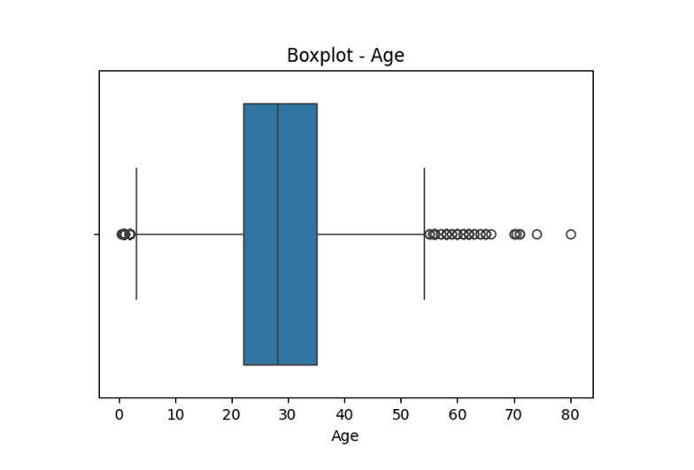
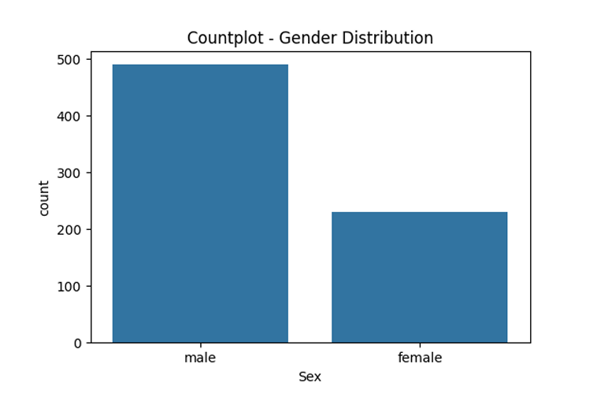
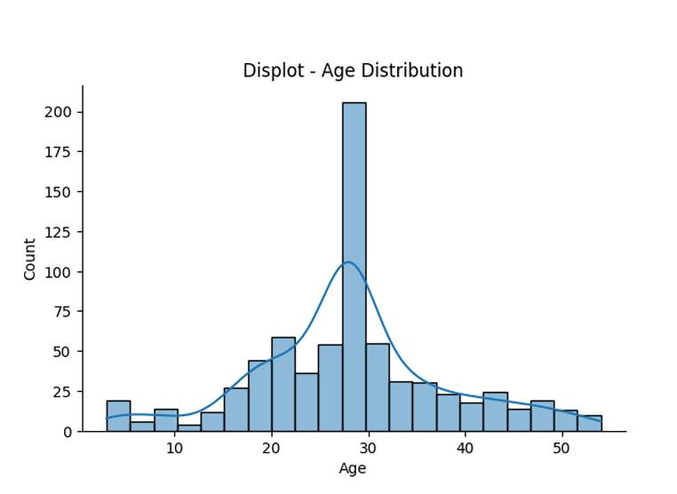
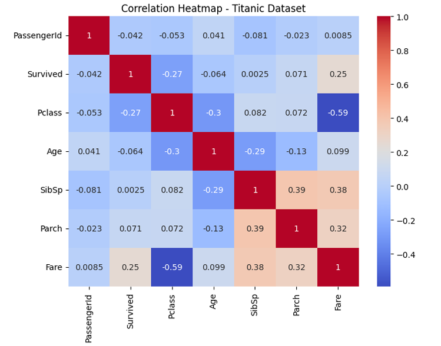

# EXNO2DS
# AIM:
      To perform Exploratory Data Analysis on the given data set.
      
# EXPLANATION:
  The primary aim with exploratory analysis is to examine the data for distribution, outliers and anomalies to direct specific testing of your hypothesis.
  
# ALGORITHM:
STEP 1: Import the required packages to perform Data Cleansing,Removing Outliers and Exploratory Data Analysis.

STEP 2: Replace the null value using any one of the method from mode,median and mean based on the dataset available.

STEP 3: Use boxplot method to analyze the outliers of the given dataset.

STEP 4: Remove the outliers using Inter Quantile Range method.

STEP 5: Use Countplot method to analyze in a graphical method for categorical data.

STEP 6: Use displot method to represent the univariate distribution of data.

STEP 7: Use cross tabulation method to quantitatively analyze the relationship between multiple variables.

STEP 8: Use heatmap method of representation to show relationships between two variables, one plotted on each axis.

## CODING AND OUTPUT

```
        #---------------------------------------
# Step 1: Import Required Packages
#---------------------------------------
import pandas as pd
import numpy as np
import seaborn as sns
import matplotlib.pyplot as plt
#---------------------------------------
# Step 2: Load the Dataset
#---------------------------------------
data = pd.read_csv("titanic_dataset.csv")
print("\nDataset Loaded Successfully\n")
print(data.head())
print("\nDataset Info:\n")
print(data.info())
print(data.describe())
#---------------------------------------
# Step 3: Data Cleansing- Handle Missing Values
#---------------------------------------
numeric_cols = data.select_dtypes(include='number').columns
categorical_cols = data.select_dtypes(exclude='number').columns
data[numeric_cols] = data[numeric_cols].apply(lambda x: x.fillna(x.median()))
data[categorical_cols] = data[categorical_cols].apply(lambda x: x.fillna(x.
↪mode()[0]))
print("Missing values handled successfully!")
#---------------------------------------
# Step 4: Boxplot to Analyze Outliers (Age & Fare)
#---------------------------------------
plt.figure(figsize=(6,4))
sns.boxplot(x=data["Age"])
plt.title("Boxplot- Age")

plt.show()
plt.figure(figsize=(6,4))
sns.boxplot(x=data["Fare"])
plt.title("Boxplot- Fare")
plt.show()
#---------------------------------------
# Step 5: Remove Outliers Using IQR Method
#---------------------------------------
def remove_outliers_iqr(df, column):
Q1 = df[column].quantile(0.25)
Q3 = df[column].quantile(0.75)
IQR = Q3- Q1
lower = Q1- 1.5 * IQR
upper = Q3 + 1.5 * IQR
return df[(df[column] >= lower) & (df[column] <= upper)]
data = remove_outliers_iqr(data, "Age")
data = remove_outliers_iqr(data, "Fare")
print("Outliers removed using IQR method.\n")
#---------------------------------------
# Step 6: Countplot for Categorical Data
#---------------------------------------
plt.figure(figsize=(6,4))
sns.countplot(x="Survived", data=data)
plt.title("Countplot- Survival Distribution")
plt.show()
plt.figure(figsize=(6,4))
sns.countplot(x="Sex", data=data)
plt.title("Countplot- Gender Distribution")
plt.show()
plt.figure(figsize=(6,4))
sns.countplot(x="Pclass", data=data)
plt.title("Countplot- Passenger Class Distribution")
plt.show()
#---------------------------------------
# Step 7: Displot for Univariate Distribution
#---------------------------------------
sns.displot(data["Age"], kde=True, height=4, aspect=1.5)
plt.title("Displot- Age Distribution")
plt.show()

sns.displot(data["Fare"],kde=True,height=4,aspect=1.5)
plt.title("Displot-FareDistribution")
plt.show()
#---------------------------------------
#Step8: Cross Tabulation
#---------------------------------------
print("\nCross Tabulation:SexvsSurvived\n")
print(pd.crosstab(data["Sex"],data["Survived"]))
print("\nCross Tabulation:PclassvsSurvived\n")
print(pd.crosstab(data["Pclass"],data["Survived"]))
#---------------------------------------
#Step9: HeatmapforCorrelationAnalysis
#---------------------------------------
plt.figure(figsize=(8,6))
correlation_matrix= data.select_dtypes(include=np.number).corr()
sns.heatmap(correlation_matrix,annot=True,cmap="coolwarm")
plt.title("CorrelationHeatmap-TitanicDataset")
plt.show()
```










# RESULT
       Thus the program has been successfully executed.